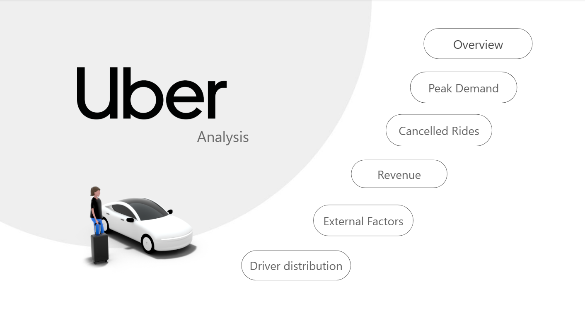
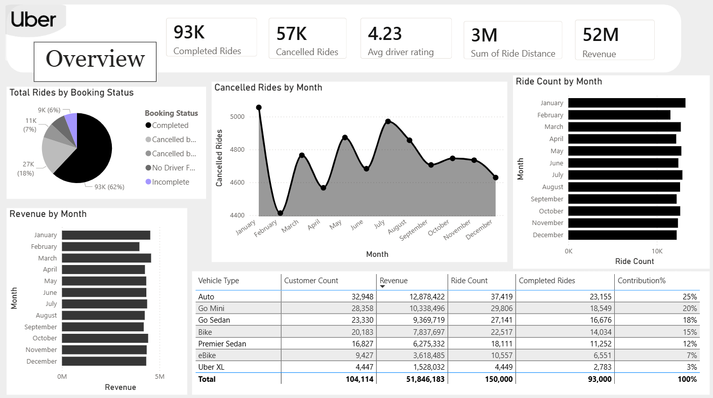
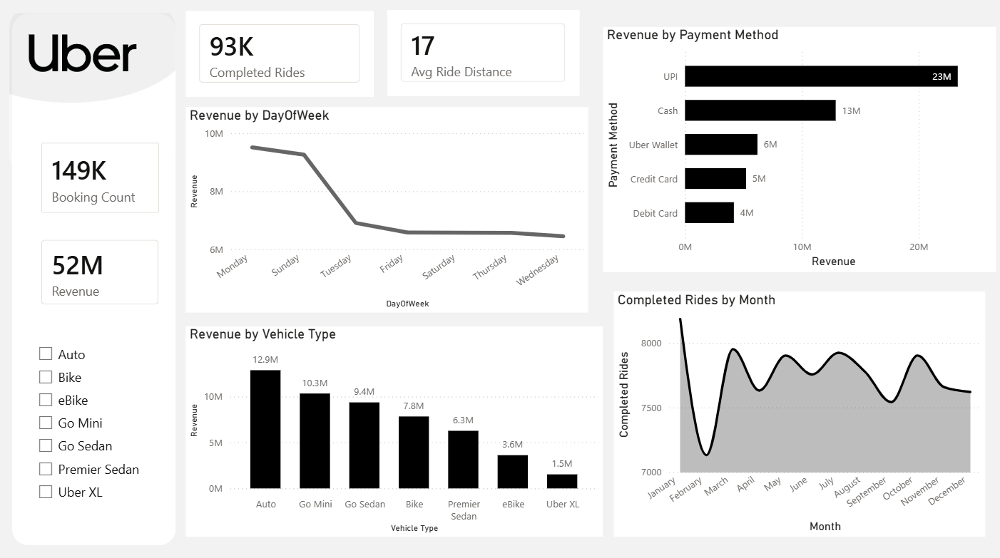

# Uber Data Analysis Dashboard (Power BI)

## Project Overview
This project presents an interactive **Uber Data Analysis Dashboard** developed using **Power BI**. The goal of the project was to transform raw Uber ride data into a structured and interactive dashboard that provides meaningful insights about ride behavior, cancellations, revenue patterns, and driver performance.

By applying data preparation, modeling, and visualization techniques, the dashboard helps uncover important trends that support better decision-making in ride-sharing operations.

---

## Dashboard Insights

The dashboard highlights several key insights:

- **Ride Behavior Trends**
  - Analysis of ride demand patterns across different hours of the day
  - Identification of peak usage times

- **Cancellation Patterns & Revenue Insights**
  - Understanding the relationship between cancellations and completed rides
  - Analysis of revenue-related metrics

- **External Factors Affecting Rides**
  - Exploration of factors that may influence ride demand and performance

- **Driver Distribution & Performance Metrics**
  - Evaluation of driver activity and ride distribution
  - Analysis of driver performance indicators

---

## Project Workflow

The project was completed through the following steps:

### 1. Data Preparation
- Cleaning the dataset
- Handling missing or inconsistent values
- Preparing the data for analysis

### 2. Data Modeling
- Creating relationships between tables
- Building a structured data model for analysis

### 3. DAX Measures
- Writing DAX calculations for key KPIs
- Creating measures for ride counts, cancellations, and performance metrics

### 4. Dashboard Design
- Designing an interactive multi-page Power BI dashboard
- Creating filters and interactive visuals
- Presenting insights in a clear and user-friendly way

---

## Tools & Technologies

- **Power BI**
- **DAX (Data Analysis Expressions)**
- **Data Cleaning**
- **Data Visualization**
- **Business Intelligence**

---

## Skills Demonstrated

- Data Analysis  
- Data Visualization  
- Business Intelligence  
- Dashboard Development  
- Data Modeling in Power BI  
- Analytical Thinking  

---

## Dashboard Preview

---

This project demonstrates how raw ride data can be transformed into an interactive dashboard that provides valuable operational insights. Using Power BI and DAX, the project highlights trends in ride behavior, cancellations, and driver performance, showcasing the power of data visualization and business intelligence tools.
